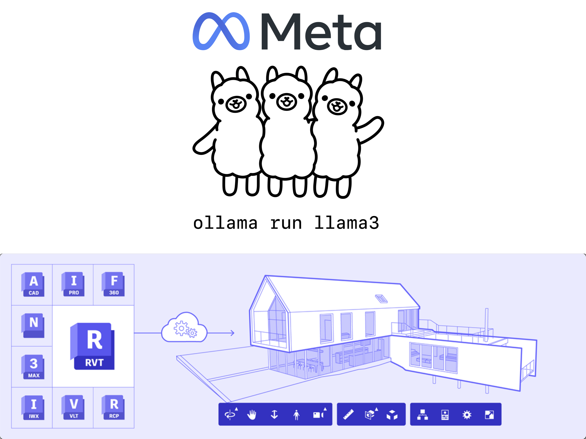

# aps-local-chatbot

Simple chatbot for querying metadata of designs in [Autodesk Platform Services](https://aps.autodesk.com) using [Ollama](https://ollama.com/) for chat completion. This project try to bring poweful of Local LLM with zero cost into Autodesk Platform Services.



[](https://www.youtube.com/watch?v=-Nr-_ZgK8qI)


## Development

### Prerequisites

- [APS credentials](https://aps.autodesk.com/en/docs/oauth/v2/tutorials/create-app)
- [Provisioned access to BIM360 or ACC](https://aps.autodesk.com/en/docs/bim360/v1/tutorials/getting-started/manage-access-to-docs/)
- [Node.js](https://nodejs.org) (Long Term Support version is recommended) - Let's use NVM to install Node.js in WSL

Install WSL(Windows Subsystem for Linux) and Ubuntu 20.04 LTS
```
wsl --install
```
Install [Ollma](https://ollama.com/) in WSL

```bash
curl https://ollama.ai/install.sh | sh
```
Run Ollama
```bash
ollama run ollama
```
Use Address : http://localhost:11434/api/chat chat completion

```bash
curl --location 'http://localhost:11434/api/chat' \
--header 'Content-Type: application/json' \
--data '{
  "model": "llama3",
  "messages": [
    { "role": "user", "content": "why is the sky blue?" }
  ]
}'
```

Download Open Sourece LLM Model from [here](https://ollama.com/search)

### Setup & Run

- Run Ollama
```bash
ollama run ollama
```

- Clone this project
- Install dependencies: `npm install`
- Specify the following environment variables:
  - `APS_CLIENT_ID` - your APS application client ID
  - `APS_CLIENT_SECRET` - your APS application client secret
  - `APS_CALLBACK_URL` - your OAuth callback
    - For local development, it should be http://localhost:8080/auth/callback
    - Don't forget to add the same URL to your APS application in https://aps.autodesk.com/myapps as well
  - `SERVER_SESSION_SECRET` - custom phrase used to encrypt/decrypt cookies
- Configure the AWS credentials ([guide](https://docs.aws.amazon.com/sdk-for-javascript/v2/developer-guide/setting-credentials-node.html)) and region
- Run the server: `npm start`
- Go to http://localhost:8080

### Seeting .env file

```bash
APS_CLIENT_ID=""
APS_CLIENT_SECRET=""
APS_CALLBACK_URL="http://localhost:8080/auth/callback"
SERVER_SESSION_SECRET=""
PORT="8080"
```
How to generate SERVER_SESSION_SECRET:
```bash
openssl rand -hex 64
```


## Resources

This is project clone from [https://github.com/petrbroz/aps-design-chatbot](https://github.com/petrbroz/aps-design-chatbot) using [Amazon Bedrock](https://aws.amazon.com/bedrock) for the backend. Please refer to the original project for more details.